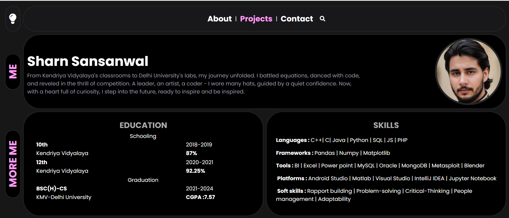
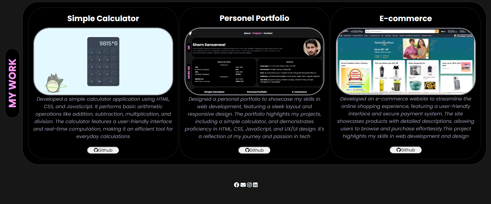

# My Portfolio

Welcome to my portfolio! This repository showcases my personal website, where you can explore information about my projects, skills, education, and more. This portfolio serves as a comprehensive overview of my work and capabilities in web development.

## Table of Contents

- [Features](#features)
- [Screenshot](#screenshot)
- [Demo](#demo)
- [Technologies Used](#technologies-used)

## Features

- **Responsive Design**: The site adjusts to different screen sizes, providing an optimal viewing experience on both desktop and mobile devices.
- **Theme Toggle**: Users can switch between dark and light themes by clicking the bulb icon.
- **Project Showcase**: View various projects I’ve worked on, including detailed descriptions and links.
- **About Me**: Information about my background, skills, and education.

## Screenshots

- **Homepage**:
  
  

## Demo

You can view a live demo of my portfolio [here](https://sumo90.github.io/Portfolio/).

## Technologies Used

- **HTML5**: For the structure of the webpage.
- **CSS3**: For styling and layout, including responsive design and theme toggling.
- **JavaScript**: For interactive features, such as the theme toggle.
- **FontAwesome**: For icons.

